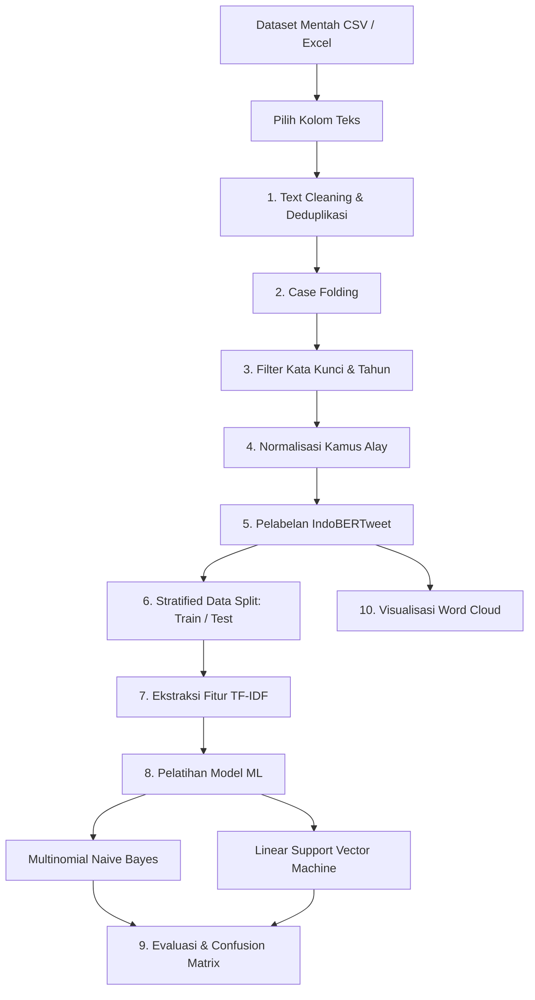

# 🔍 SentimenAja: Analisis Sentimen Teks Twitter Terkait Polri

Aplikasi web interaktif berbasis **Streamlit** untuk analisis sentimen opini publik pada media sosial (Twitter/X) terkait **Kepolisian Negara Republik Indonesia (Polri)**. Sistem ini mengintegrasikan model Deep Learning Transformer (**IndoBERTweet**) untuk pelabelan otomatis (*pseudo-labeling*) serta model Machine Learning klasik (**Multinomial Naive Bayes** & **Support Vector Machine**) dengan pembobotan **TF-IDF**.

---

## 📑 Daftar Isi
- [Tentang Projek](#-tentang-projek)
- [Tech Stack & Dependensi](#-tech-stack--dependensi)
- [Fitur Utama](#-fitur-utama)
- [Alur Kerja Pipeline](#-alur-kerja-pipeline)
- [Struktur Projek](#-struktur-projek)
- [Instalasi & Menjalankan Aplikasi](#-instalasi--menjalankan-aplikasi)
- [Panduan Penggunaan](#-panduan-penggunaan)
- [Lisensi](#-lisensi)

---

## 📌 Tentang Projek

Opini masyarakat di media sosial seperti Twitter/X sering kali memuat tanggapan, aspirasi, keluhan, dan apresiasi terhadap kinerja institusi kepolisian. **SentimenAja** hadir sebagai solusi analisis teks terpadu yang membantu:
1. **Mengotomatisasi Pelabelan Data**: Memanfaatkan model pre-trained IndoBERTweet yang telah di-fine-tune khusus untuk bahasa Indonesia gaya Twitter untuk melabeli tweet menjadi sentimen **Positif** atau **Negatif**.
2. **Menjalankan Pipeline NLP Lengkap**: Memberikan transparansi pada setiap tahapan praproses teks (pembersihan, case folding, filtering kata kunci, normalisasi bahasa alay/slang).
3. **Melatih & Membandingkan Model ML**: Mengevaluasi performa model Naive Bayes dan SVM berdasarkan representasi fitur TF-IDF (N-gram).
4. **Analisis Teks Tunggal (*Real-time Inference*)**: Menguji kalimat atau postingan baru secara instan untuk melihat probabilitas, skor keyakinan (*confidence score*), dan komparasi hasil prediksi dari seluruh model.

---

## 🛠️ Tech Stack & Dependensi

| Kategori | Teknologi / Pustaka | Keterangan & Peran |
| :--- | :--- | :--- |
| **Bahasa Pemrograman** | [Python](https://www.python.org/) (>= 3.9) | Bahasa pemrograman utama |
| **Framework Antarmuka** | [Streamlit](https://streamlit.io/) | Framework UI web interaktif & dashboard analitik |
| **Deep Learning / NLP** | [Hugging Face Transformers](https://huggingface.co/transformers/) | Pipeline inferensi model Transformer |
| | [PyTorch](https://pytorch.org/) | Backend komputasi tensor (mendukung akselerasi GPU CUDA & CPU) |
| | **Model IndoBERTweet** (`Aardiiiiy/indobertweet-base-Indonesian-sentiment-analysis`) | Fine-tuned Transformer model untuk klasifikasi sentimen teks bahasa Indonesia |
| | [NLTK](https://www.nltk.org/) | Tokenisasi kata (`punkt`, `punkt_tab`) |
| **Machine Learning** | [Scikit-Learn](https://scikit-learn.org/) | - `TfidfVectorizer`: Ekstraksi fitur n-gram & sublinear TF<br>- `MultinomialNB`: Klasifikasi Naive Bayes<br>- `LinearSVC`: Klasifikasi Support Vector Machine<br>- `train_test_split`, `metrics`: Evaluasi performa model |
| **Pengolahan Data** | [Pandas](https://pandas.pydata.org/) | Manipulasi DataFrame, pembacaan format CSV dan Excel (`.xlsx`, `.xls`) |
| | [NumPy](https://numpy.org/) | Operasi matriks numerik dan kalkulasi frekuensi dokumen (*document frequency*) |
| | `re`, `html` | Regex untuk *cleaning* (URL, mention, hashtag, angka, simbol) & decoding HTML entities |
| | [Requests](https://requests.readthedocs.io/) | Pengunduhan otomatis Kamus Alay *multi-source* dari repositori publik |
| **Visualisasi Data** | [Matplotlib](https://matplotlib.org/) | Grafik distribusi sentimen, confidence bar chart, dan sebaran data per tahun |
| | [Seaborn](https://seaborn.pydata.org/) | Visualisasi heatmap *Confusion Matrix* |
| | [WordCloud](https://github.com/amueller/word_cloud) | Visualisasi awan kata (*word cloud*) sentimen Positif & Negatif |

---

## ✨ Fitur Utama

- 📂 **Multi-Format Dataset Loader**: Mendukung upload file dataset berformat `.csv`, `.xlsx`, dan `.xls` dengan preview interaktif.
- 🎯 **Seleksi Kolom Teks Dinamis**: Fleksibilitas memilih kolom teks yang ingin dianalisis (misal: `full_text`, `tweet`, `content`).
- 🧹 **Pembersihan Teks Mendalam**: Menghapus tautan/URL, mention (`@user`), hashtag (`#`), emoji/karakter non-ASCII, angka, tanda baca, karakter berulang, dan duplikasi data.
- 🔍 **Filter Kata Kunci & Rentang Waktu**: Dilengkapi dengan 70+ kata kunci default institusi & kepangkatan Polri (dapat dikustomisasi) serta penyaringan tahun (*created_at*).
- 📚 **Normalisasi Bahasa Slang/Alay Terintegrasi**: Menggunakan kamus alay Nasalsabila (4.300+ entri) dengan mekanisme *auto-download* multi-sumber, fallback, dan dukungan upload manual (CSV/JSON/TXT).
- 🤖 **Auto-Labeling Berbasis Deep Learning**: Pelabelan otomatis dengan model Transformer IndoBERTweet disertai *progress bar* dan skor keyakinan.
- ⚙️ **Konfigurasi Vektorisasi TF-IDF**: Pengaturan N-gram (*min/max*), batas fitur (*max features*), dan *sublinear TF*.
- 📊 **Evaluasi Komparatif & Visual**:
  - Metrik akurasi, precision, recall, dan f1-score lengkap (*classification report*).
  - Visualisasi Heatmap *Confusion Matrix* untuk Naive Bayes dan SVM.
  - Grafik *Top-30 Terms Document Frequency* dan kata kunci Polri.
  - *Word Cloud* visual untuk sentimen positif dan negatif.
- ✍️ **Mode Inferensi Teks Tunggal**: Input teks kustom secara langsung untuk melihat tahapan praproses dan perbandingan hasil prediksi seluruh model.

---

## 🔄 Alur Kerja Pipeline



---

## 📁 Struktur Projek

```text
SentimenAja/
├── .devcontainer/         # Konfigurasi container development
├── .github/               # Konfigurasi GitHub workflow
├── streamlit_app.py       # Source code utama aplikasi Streamlit
├── requirements.txt       # Daftar dependensi & pustaka Python
├── README.md              # Dokumentasi lengkap projek
├── LICENSE                # Lisensi projek (Apache-2.0)
└── .gitignore             # File yang diabaikan oleh Git
```

---

## 🚀 Instalasi & Menjalankan Aplikasi

### 1. Clone Repositori
```bash
git clone https://github.com/AriellaRisqyM/SentimenAja.git
cd SentimenAja
```

### 2. Buat & Aktifkan Virtual Environment (Disarankan)
**Windows (PowerShell / Command Prompt):**
```bash
python -m venv venv
venv\Scripts\activate
```

**Linux / macOS:**
```bash
python3 -m venv venv
source venv/bin/activate
```

### 3. Install Dependensi
```bash
pip install --upgrade pip
pip install -r requirements.txt
```

### 4. Jalankan Aplikasi
```bash
streamlit run streamlit_app.py
```
Aplikasi akan otomatis terbuka di browser pada alamat `http://localhost:8501`.

---

## 📖 Panduan Penggunaan

### 1. Modul Analisis Dataset
1. Buka menu **📊 Analisis Dataset** pada bilah sisi (*sidebar*).
2. Upload file dataset Twitter Anda (`.csv` atau `.xlsx`).
3. Tentukan kolom teks yang akan diproses pada dropdown **Pilih Kolom Teks**.
4. Jalankan setiap langkah praproses secara berurutan mulai dari **Langkah 1 (Cleaning)** hingga **Langkah 10 (Word Cloud)**.
5. Perhatikan metrik dan grafik yang muncul di setiap langkah untuk mengevaluasi data dan performa model.

### 2. Modul Analisis Teks Tunggal
1. Buka menu **✍️ Analisis Teks Tunggal** pada bilah sisi.
2. Masukkan kalimat atau tweet yang ingin diuji pada kotak teks.
3. Klik tombol **🔍 Analisis Sentimen**.
4. Sistem akan menampilkan detail hasil praproses teks, hasil prediksi IndoBERTweet beserta grafik skor keyakinan, serta prediksi model Naive Bayes dan SVM (bila model telah dilatih pada modul dataset).

---

## 📄 Lisensi

Projek ini didistribusikan di bawah lisensi [Apache License 2.0](LICENSE). Silakan gunakan dan kembangkan sesuai kebutuhan dengan tetap mencantumkan atribusi pengembang.
