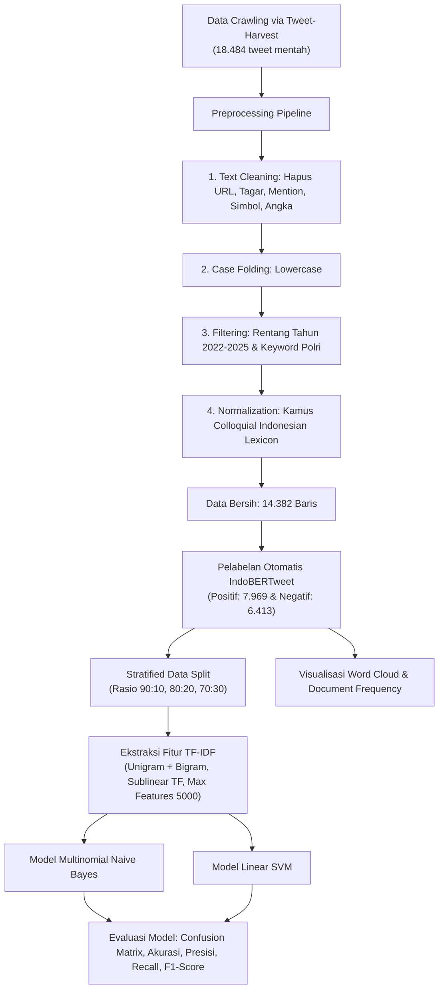

# 🔍 SentimenAja: Analisis Sentimen Opini Publik terhadap Polri di Platform X (Twitter)

> **Produk Luaran Tugas Akhir / Skripsi**  
> Program Studi S1 Teknik Informatika — Fakultas Ilmu Komputer  
> **Universitas Dian Nuswantoro (UDINUS) Semarang** (2026)  
> **Peneliti:** Ariella Risqy Maulana (NIM: A11.2022.14035)  
> **Dosen Pembimbing:** Yani Parti Astuti, M.Kom  

---

## 📑 Daftar Isi
- [Ringkasan Eksekutif & Abstrak Skripsi](#-ringkasan-eksekutif--abstrak-skripsi)
- [Latar Belakang & Identifikasi Masalah](#-latar-belakang--identifikasi-masalah)
- [Metodologi Penelitian & Pipeline Sistem](#-metodologi-penelitian--pipeline-sistem)
- [Temuan & Hasil Komparasi Model](#-temuan--hasil-komparasi-model)
- [Tech Stack & Arsitektur Teknologi](#-tech-stack--arsitektur-teknologi)
- [Modul & Fitur Aplikasi](#-modul--fitur-aplikasi)
- [Panduan Instalasi & Menjalankan Aplikasi](#-panduan-instalasi--menjalankan-aplikasi)
- [Struktur Direktori](#-struktur-direktori)
- [Daftar Pustaka](#-daftar-pustaka)
- [Sitasi & Hak Cipta](#-sitasi--hak-cipta)

---

## 🎓 Ringkasan Eksekutif & Abstrak Skripsi

### Judul Skripsi:
> **"ANALISIS SENTIMEN TERHADAP KEPOLISIAN NEGARA REPUBLIK INDONESIA PERIODE 2022 - 2025 MENGGUNAKAN PERBANDINGAN MULTINOMIAL NAIVE BAYES DAN SUPPORT VECTOR MACHINE LINEAR"**

### Abstrak:
Kemajuan teknologi media sosial membuka ruang luas bagi publik untuk mengevaluasi kinerja pelayan masyarakat, termasuk Kepolisian Negara Republik Indonesia (Polri). Di sisi lain, tingginya intensitas publikasi negatif terkait isu kekerasan serta penyalahgunaan wewenang berisiko mereduksi kredibilitas institusi.

Penelitian ini diorientasikan untuk mengetahui sentimen masyarakat terhadap Polri di platform X periode 2022–2025 dengan mengomparasikan keandalan algoritma **Multinomial Naïve Bayes (MNB)** dan **Linear Support Vector Machine (Linear SVM)**. Pendekatan web scraping berhasil menghimpun **18.484 data mentah** yang menyisakan **14.382 data bersih** pascaproses pembersihan. Anotasi sentimen berbasis model deep learning **IndoBERTweet** mengidentifikasi adanya **7.969 data positif (55,4%)** dan **6.413 data negatif (44,6%)**. 

Proses ekstraksi fitur menerapkan pembobotan **TF-IDF (unigram dan bigram)** dengan pengujian pada tiga variasi proporsi data (**90:10, 80:20, dan 70:30**). Eksperimen menunjukkan bahwa **SVM Linier secara konsisten mengungguli MNB**, dengan capaian puncak pada rasio **90:10** yang mencatatkan **Akurasi 92,49%**, **Recall 92,84%**, dan **F1-score 93,18%**. Kendati demikian, MNB menonjol secara spesifik pada stabilitas nilai **Presisi di kisaran 95,65%–96,18%**. Kesimpulannya, SVM Linier terbukti lebih efektif dan minim bias dalam mengklasifikasikan tren opini publik terhadap kepolisian.

**Kata Kunci:** *Analisis Sentimen, Kepolisian Negara Republik Indonesia, IndoBERTweet, Multinomial Naïve Bayes, Support Vector Machine Linear, TF-IDF, Streamlit.*

---

## 🎯 Latar Belakang & Identifikasi Masalah

1. **Volume Data Tak Terstruktur yang Masif**: Opini publik mengenai kinerja Polri di platform X mengalir dalam volume besar, dinamis, dan tidak terstruktur. Evaluasi manual rentan terhadap bias subjektivitas serta keterbatasan waktu.
2. **Kebutuhan Pseudo-Labeling yang Akurat**: Pelabelan ribuan data tweet secara manual membutuhkan sumber daya besar. Penggunaan model Transformer bahasa informal seperti *IndoBERTweet* menjadi solusi anotasi otomatis (*pseudo-labeling*) berkualitas tinggi.
3. **Urgensi Perbandingan Algoritma Klasifikasi**: Diperlukan studi komparatif antara algoritma probabilistik (*Multinomial Naive Bayes*) dan algoritma pemisah bidang spasial (*Linear Support Vector Machine*) dalam menangani data teks berdimensi tinggi dengan variasi rasio data.
4. **Implementasi Sistem Praktis**: Menghadirkan sistem perangkat lunak berbasis antarmuka grafis (*Graphical User Interface*) yang memungkinkan pengujian dataset maupun analisis kalimat secara instan (*real-time*).

---

## 🔬 Metodologi Penelitian & Pipeline Sistem

Alur kerja metodologis yang diterapkan dalam penelitian dan diimplementasikan ke dalam aplikasi:



---

## 📊 Temuan & Hasil Komparasi Model

Evaluasi model dilakukan menggunakan *Confusion Matrix* pada 3 variasi skenario pembagian data:

| Rasio Data (Train : Test) | Algoritma Model | Akurasi (%) | Presisi (%) | Recall (%) | F1-Score (%) |
| :---: | :--- | :---: | :---: | :---: | :---: |
| **90 : 10** | **Linear SVM (Terbaik)** | **92,49%** | **93,55%** | **92,84%** | **93,18%** |
| *(12.943 : 1.439)* | Multinomial Naïve Bayes | 90,06% | **96,18%** | 85,44% | 90,48% |
| **80 : 20** | **Linear SVM** | **91,44%** | **92,92%** | **91,53%** | **92,20%** |
| *(11.505 : 2.877)* | Multinomial Naïve Bayes | 89,67% | **95,89%** | 85,00% | 90,10% |
| **70 : 30** | **Linear SVM** | **90,56%** | **92,39%** | **90,42%** | **91,38%** |
| *(10.067 : 4.315)* | Multinomial Naïve Bayes | 89,38% | **95,65%** | 84,69% | 89,82% |

### Analisis Hasil:
1. **Keunggulan Linear SVM**: SVM Linear mencatatkan performa terbaik di seluruh rasio data dengan F1-Score konsisten $>91\%$. Kernel linear sangat optimal untuk teks TF-IDF berdimensi tinggi yang bersifat *linearly separable*.
2. **Karakteristik Multinomial Naive Bayes**: MNB mencatatkan nilai Presisi tertinggi ($95,65\% - 96,18\%$), menandakan MNB sangat selektif dan minim menghasilkan kesalahan *False Positive*.
3. **Karakteristik Opini Publik**: 
   - **Sentimen Positif (55,4%)**: Dominan pada topik pelayanan masyarakat, patroli kamtibmas, dan implementasi program Polri Presisi.
   - **Sentimen Negatif (44,6%)**: Terpusat pada kritik tajam terkait kasus hukum viral (misal kasus Sambo), penindakan tilang, dan perilaku oknum aparat.

---

## 🛠️ Tech Stack & Arsitektur Teknologi

| Komponen | Pustaka / Tools | Peran dalam Sistem |
| :--- | :--- | :--- |
| **Bahasa Utama** | Python 3.13 / 3.9+ | Inti komputasi & logika program |
| **Web Dashboard** | Streamlit | Framework antarmuka grafis interaktif berbasis web |
| **Data Crawling** | Tweet Harvest (`npx`) | Web scraping data cuitan platform X tanpa batasan kuota API resmi |
| **Anotasi Data** | Hugging Face Transformers & PyTorch | Inferensi model deep learning `Aardiiiiy/indobertweet-base-Indonesian-sentiment-analysis` |
| **Klasifikasi & TF-IDF** | Scikit-Learn | `TfidfVectorizer`, `MultinomialNB`, `LinearSVC`, `train_test_split`, `metrics` |
| **Normalisasi Slang** | Kamus Alay (Colloquial Indonesian Lexicon) | Konversi kata non-baku (4.300+ lema) via HTTP dynamic downloader |
| **Data Wrangling** | Pandas & NumPy | Manajemen dataset tabular, I/O CSV & Excel, matriks DF |
| **Visualisasi** | Matplotlib, Seaborn, WordCloud | Visualisasi grafik batang, heatmap matriks konfusi, dan awan kata |

---

## 💻 Modul & Fitur Aplikasi

Aplikasi **SentimenAja** dibangun dengan dua mode navigasi utama:

### 1. 📊 Modul Analisis Dataset
- **Unggah Dataset & Pemilih Kolom**: Input file CSV/Excel dengan pratinjau interaktif.
- **Pipeline 10 Langkah Terpadu**:
  1. *Text Cleaning* (pembersihan noise & drop duplicate).
  2. *Case Folding* (penyeragaman huruf kecil).
  3. *Filter Keyword & Tahun* (70+ kata kunci Polri bawaan/kustom).
  4. *Normalisasi Kamus Alay* (multi-source download + opsi manual upload).
  5. *Pelabelan IndoBERTweet* (auto-labeling dengan progress bar & status GPU/CPU).
  6. *Data Splitting* (konfigurasi persentase train-test dengan stratifikasi).
  7. *TF-IDF Vectorization* (analisis Top-30 terms & document frequency kata kunci Polri).
  8. *Pelatihan Model ML* (training Naive Bayes & Linear SVM dengan tabel classification report).
  9. *Confusion Matrix Heatmap* (evaluasi visual prediksi vs aktual).
  10. *Word Cloud Sentimen* (visualisasi kata kunci positif vs negatif).

### 2. ✍️ Modul Analisis Teks Tunggal (*Real-Time Inference*)
- Input teks opini bebas dari pengguna.
- Eksekusi praproses instan (*Cleaning* $\rightarrow$ *Case Folding* $\rightarrow$ *Normalisasi*).
- Prediksi instan IndoBERTweet dilengkapi visualisasi *Confidence Score Bar*.
- Prediksi komparatif model Machine Learning (Multinomial NB & Linear SVM) beserta probabilitas kelas dan ringkasan metrik dari data uji.

---

## 🚀 Panduan Instalasi & Menjalankan Aplikasi

### 1. Persiapan Lingkungan
```bash
# Clone repositori
git clone https://github.com/AriellaRisqyM/SentimenAja.git
cd SentimenAja

# Buat virtual environment
python -m venv venv

# Aktivasi virtual environment
# Windows:
venv\Scripts\activate
# Linux/macOS:
source venv/bin/activate
```

### 2. Instalasi Dependensi
```bash
pip install --upgrade pip
pip install -r requirements.txt
```

### 3. Menjalankan Dashboard
```bash
streamlit run streamlit_app.py
```
Akses dasbor aplikasi di peramban web Anda melalui: `http://localhost:8501`.

---

## 📁 Struktur Direktori

```text
SentimenAja/
├── .devcontainer/         # Konfigurasi container development VS Code
├── .github/               # Workflows & automasi repositori
├── streamlit_app.py       # Kode sumber utama aplikasi Streamlit
├── requirements.txt       # Daftar dependensi & paket pustaka Python
├── README.md              # Dokumentasi lengkap sistem dan skripsi
├── LICENSE                # Lisensi Apache-2.0
└── .gitignore             # File pengecualian Git
```

---

## 📚 Daftar Pustaka

1. **Aardiiiy.** (2025). *indobertweet-base-Indonesian-sentiment-analysis* (Revision 01ef069). Hugging Face. [https://doi.org/10.57967/hf/5111](https://doi.org/10.57967/hf/5111)
2. **Baihaqi, M. F., Magdalena, L., & Fahrudin, R.** (2025). Analisis Sentimen Aplikasi Deepseek Menggunakan Metode Naive Bayes dan Support Vector Machine. *RIGGS: Journal of Artificial Intelligence and Digital Business*, 4(3), 4051–4062. [https://doi.org/10.31004/riggs.v4i3.2511](https://doi.org/10.31004/riggs.v4i3.2511)
3. **Bill Fatric Ginting, S., Novarina Tarigan, E., Sihaloho, B., Telaumbanua, J., & Sehati, Stik.** (2025). Analisis Sentimen Opini Publik terhadap Rumah Sakit Pemerintah dan Swasta di Indonesia Menggunakan Algoritma Naïve Bayes. (Vol. 10, No. 01).
4. **Damayanti, N. M., Ariningtyas, I. D., & Icham, M. I. A.** (2025). ANALISIS SENTIMEN PUBLIK PADA TAGAR #BTSCOMEBACK DI PLATFORM X MENGGUNAKAN INDOBERTWEET. *Jurnal Informatika Dan Teknik Elektro Terapan*, 13(3). [https://doi.org/10.23960/jitet.v13i3.7176](https://doi.org/10.23960/jitet.v13i3.7176)
5. **Dewi, C., Chen, R.-C., Christanto, H. J., & Cauteruccio, F.** (2023). Multinomial Naïve Bayes Classifier for Sentiment Analysis of Internet Movie Database. *Vietnam Journal of Computer Science*, 10(04), 485–498. [https://doi.org/10.1142/S2196888823500100](https://doi.org/10.1142/S2196888823500100)
6. **Enhartana, A. C., Saputra, Z., Sapata Negara, A. S., Wahyudi, A. S., Hidayanto, A. N., & Suryono, R. R.** (2025). Machine Learning Approach to Evaluate Public Perception: Sentiment Analysis of Mobile Government App User Reviews. *2025 International Conference on Informatics, Multimedia, Cyber and Information System (ICIMCIS)*, 1487–1492. [https://doi.org/10.1109/ICIMCIS68501.2025.11326982](https://doi.org/10.1109/ICIMCIS68501.2025.11326982)
7. **Hanin, A. S., & Maryam, M.** (2025). Sentiment Analysis of Twitter Towards the Free Lunch Program Using the C4.5 Algorithm. *International Journal of Advances in Data and Information Systems*, 6(1), 31–45. [https://doi.org/10.59395/ijadis.v6i1.1357](https://doi.org/10.59395/ijadis.v6i1.1357)
8. **Imaddudin, S., Astuti, I., & Ruhama, S.** (2025). Studi Sentimen Masyarakat terhadap PSSI di Era Erick Thohir menggunakan Algoritma Support Vector Machine (SVM) pada Media Sosial X. *Jurnal Penelitian Multidisiplin Bangsa*, 1(8), 1003–1013. [https://doi.org/10.59837/jpnmb.v1i8.193](https://doi.org/10.59837/jpnmb.v1i8.193)
9. **Jannah, N. Z. B., & Kusnawi, K.** (2024). Comparison of Naïve Bayes and SVM in Sentiment Analysis of Product Reviews on Marketplaces. *Sinkron*, 8(2), 727–733. [https://doi.org/10.33395/sinkron.v8i2.13559](https://doi.org/10.33395/sinkron.v8i2.13559)
10. **Kurniawan, F., Muliya Ma, A., & Roosita Cindrakasih, R.** (2025). Pemolisian dan Media: Dinamika Representasi dan Dampaknya pada Persepsi Publik. *Journal Of Social Science Research*, 5, 2107–2122.
11. **Maulana, B. A., Fahmi, M. J., Imran, A. M., & Hidayati, N.** (2024). Analisis Sentimen Terhadap Aplikasi Pluang Menggunakan Algoritma Naive Bayes dan Support Vector Machine (SVM). *MALCOM: Indonesian Journal of Machine Learning and Computer Science*, 4(2), 375–384. [https://doi.org/10.57152/malcom.v4i2.1206](https://doi.org/10.57152/malcom.v4i2.1206)
12. **Ningsih, W., Alfianda, B., Rahmaddeni, R., & Wulandari, D.** (2024). Perbandingan Algoritma SVM dan Naïve Bayes dalam Analisis Sentimen Twitter pada Penggunaan Mobil Listrik di Indonesia. *MALCOM: Indonesian Journal of Machine Learning and Computer Science*, 4(2), 556–562. [https://doi.org/10.57152/malcom.v4i2.1253](https://doi.org/10.57152/malcom.v4i2.1253)
13. **Nurhaliza Agustina, C. A., Novita, R., Mustakim, & Rozanda, N. E.** (2024). The Implementation of TF-IDF and Word2Vec on Booster Vaccine Sentiment Analysis Using Support Vector Machine Algorithm. *Procedia Computer Science*, 234, 156–163. [https://doi.org/10.1016/j.procs.2024.02.162](https://doi.org/10.1016/j.procs.2024.02.162)
14. **Nurpandi, F., Sulaeman, F. S., & Hermawan, A.** (2024). Analisis Sentimen Terhadap Kinerja Kepolisian Indonesia Menggunakan Metode Multinomial Naive Bayes, Long Short-Term Memory, dan Lexicon-Based. *Media Jurnal Informatika*, 16(1), 1. [https://doi.org/10.35194/mji.v16i1.4165](https://doi.org/10.35194/mji.v16i1.4165)
15. **Putri, V. P., Rahmawati, S. F., & Zia, A.** (2023). Kajian Terhadap Penggunaan Internet Terkait Etika Bersosial Media Dengan Melihat Hukum Di Indonesia Dalam Melindungi Masyarakatnya. *Das Sollen: Jurnal Kajian Kontemporer Hukum Dan Masyarakat*, 02(01).
16. **Ramadhani, B., & Suryono, R. R.** (2024). Komparasi Algoritma Naïve Bayes dan Logistic Regression Untuk Analisis Sentimen Metaverse. *JURNAL MEDIA INFORMATIKA BUDIDARMA*, 8(2), 714. [https://doi.org/10.30865/mib.v8i2.7458](https://doi.org/10.30865/mib.v8i2.7458)
17. **Ramdhan Hakiki, Pambudi, A., & Asriyanik.** (2024). Classification of Public Sentiment Toward 2024 Presidential Candidates on Social Media Platform X Using Naïve Bayes Algorithm. *Journal of Artificial Intelligence and Engineering Applications (JAIEA)*, 3(2), 551–556. [https://doi.org/10.59934/jaiea.v3i2.422](https://doi.org/10.59934/jaiea.v3i2.422)
18. **Salsa Desia Fitri, & Parjito.** (2025). Perbandingan Metode Naïve Bayes dan Support Vector Machine Pada Kasus Pembunuhan Vina Cirebon Berdasarkan Data X. *JUSTINDO (Jurnal Sistem Dan Teknologi Informasi Indonesia)*, 10(1), 39–49. [https://doi.org/10.32528/justindo.v10i1.2550](https://doi.org/10.32528/justindo.v10i1.2550)
19. **Sarah, D. F., Khaira, U., & Putri, M. F.** (2025). Analisis Sentimen Aplikasi Shopeepay Menggunakan Naïve Bayes Dan Pemodelan Topik Latent Dirichlet Allocation. *Djtechno: Jurnal Teknologi Informasi*, 6(2), 402–416. [https://doi.org/10.46576/djtechno.v6i2.6586](https://doi.org/10.46576/djtechno.v6i2.6586)
20. **Sari B, I., Wajidi, F., & Rasyid, Muh. R.** (2025). Implementasi Support Vector Machine Untuk Analisis Sentimen Robot Polisi Humanoid. *Simtek: Jurnal Sistem Informasi Dan Teknik Komputer*, 10(2), 329–335. [https://doi.org/10.51876/simtek.v10i2.1623](https://doi.org/10.51876/simtek.v10i2.1623)
21. **Setiawan, A., & Suryono, R. R.** (2024). Analisis Sentimen Ibu Kota Nusantara menggunakan Algoritma Support Vector Machine dan Naïve Bayes. *Edumatic: Jurnal Pendidikan Informatika*, 8(1), 183–192. [https://doi.org/10.29408/edumatic.v8i1.25667](https://doi.org/10.29408/edumatic.v8i1.25667)
22. **Sudirman, Y., & Dwi Sartika Simatupang.** (2025). Analisis Sentimen Berbasis Aspek Pada Ulasan Hotel Xyz Di Kota Tangerang Dengan Algoritma Svm. *STORAGE: Jurnal Ilmiah Teknik Dan Ilmu Komputer*, 4(4), 370–377. [https://doi.org/10.55123/storage.v4i4.6611](https://doi.org/10.55123/storage.v4i4.6611)
23. **Syam, Abd. A., Hardy M, G., Salim, A., Surianto, D. F., & Fajar B, M.** (2024). Analisis Teknik Preprocessing Pada Sentimen Masyarakat Terkait Konflik Israel-Palestina Menggunakan Support Vector Machine. *JIPI (Jurnal Ilmiah Penelitian Dan Pembelajaran Informatika)*, 9(3), 1464–1472. [https://doi.org/10.29100/jipi.v9i3.5527](https://doi.org/10.29100/jipi.v9i3.5527)
24. **Wahyudi, D., & Sibaroni, Y.** (2022). Deep Learning for Multi-Aspect Sentiment Analysis of TikTok App using the RNN-LSTM Method. *Building of Informatics, Technology and Science (BITS)*, 4(1). [https://doi.org/10.47065/bits.v4i1.1665](https://doi.org/10.47065/bits.v4i1.1665)
25. **Yusran, M., Siswanto, S., & Islamiyati, A.** (n.d.). *SISTEMASI: Jurnal Sistem Informasi Comparison of Multinomial Naïve Bayes and Bernoulli Naïve Bayes on Sentiment Analysis of Kurikulum Merdeka with Query Expansion Ranking*. [http://sistemasi.ftik.unisi.ac.id](http://sistemasi.ftik.unisi.ac.id)
26. **Zufria, I., Lubis, A. H., & Febiyaula, S. S.** (2024). Analisis Sentimen Kepercayaan Masyarakat Terhadap Kepolisian Republik Indonesia Menggunakan Algoritma Svm. *Journal of Science and Social Research*, (3). [http://jurnal.goretanpena.com/index.php/JSSR](http://jurnal.goretanpena.com/index.php/JSSR)

---

## 📄 Sitasi & Hak Cipta

Karya ini merupakan luaran penelitian Tugas Akhir / Skripsi di Universitas Dian Nuswantoro Semarang.

```bibtex
@article{maulana2026analisissentimen,
  author    = {Ariella Risqy Maulana},
  title     = {Analisis Sentimen Terhadap Kepolisian Negara Republik Indonesia Periode 2022 - 2025 Menggunakan Perbandingan Multinomial Naive Bayes Dan Support Vector Machine Linear},
  school    = {Fakultas Ilmu Komputer, Universitas Dian Nuswantoro Semarang},
  year      = {2026}
}
```

Didistribusikan di bawah lisensi [Apache License 2.0](LICENSE).
